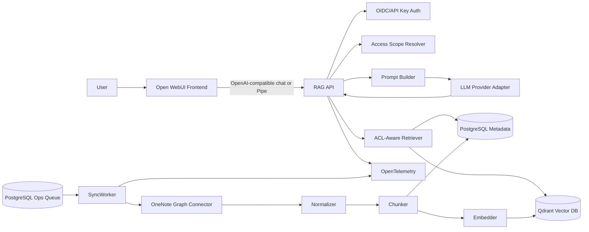

# Architecture Diagram

```mermaid
flowchart LR
    User[User] --> OpenWebUI[Open WebUI Frontend]
    OpenWebUI -->|OpenAI-compatible chat or Pipe| RagApi[RAG API]

    RagApi --> Auth[OIDC/API Key Auth]
    RagApi --> Scope[Access Scope Resolver]
    RagApi --> Retriever[ACL-Aware Retriever]
    RagApi --> Prompt[Prompt Builder]
    Prompt --> LLM[LLM Provider Adapter]
    LLM --> RagApi

    Retriever --> Qdrant[(Qdrant Vector DB)]
    Retriever --> Postgres[(PostgreSQL Metadata)]

    SyncWorker --> OneNote[OneNote Graph Connector]
    OneNote --> Normalizer
    Normalizer --> Chunker[Chunker]
    Chunker --> Embedder[Embedder]
    Embedder --> Qdrant
    Chunker --> Postgres

    OpsQueue[(PostgreSQL Ops Queue)] --> SyncWorker

    RagApi --> OTel[OpenTelemetry]
    SyncWorker --> OTel
```
