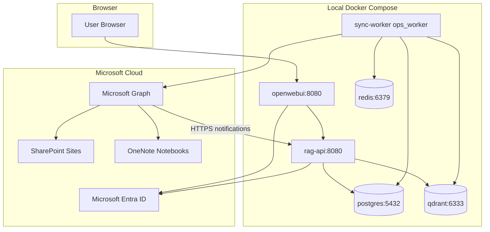

# Deployment Diagram

```mermaid
flowchart TB
    subgraph Browser
        User[User Browser]
    end

    subgraph DockerCompose[Local Docker Compose]
        OpenWebUI[openwebui:8080]
        RagApi[rag-api:8080]
        SyncWorker[sync-worker ops_worker]
        Postgres[(postgres:5432)]
        Redis[(redis:6379)]
        Qdrant[(qdrant:6333)]
    end

    subgraph MicrosoftCloud[Microsoft Cloud]
        Entra[Microsoft Entra ID]
        Graph[Microsoft Graph]
        SharePoint[SharePoint Sites]
        OneNote[OneNote Notebooks]
    end

    User --> OpenWebUI
    OpenWebUI --> RagApi
    OpenWebUI --> Entra
    RagApi --> Entra
    RagApi --> Postgres
    RagApi --> Qdrant
    SyncWorker --> Postgres
    SyncWorker --> Redis
    SyncWorker --> Qdrant
    SyncWorker --> Graph
    Graph --> SharePoint
    Graph --> OneNote
    Graph -->|HTTPS notifications| RagApi
```
