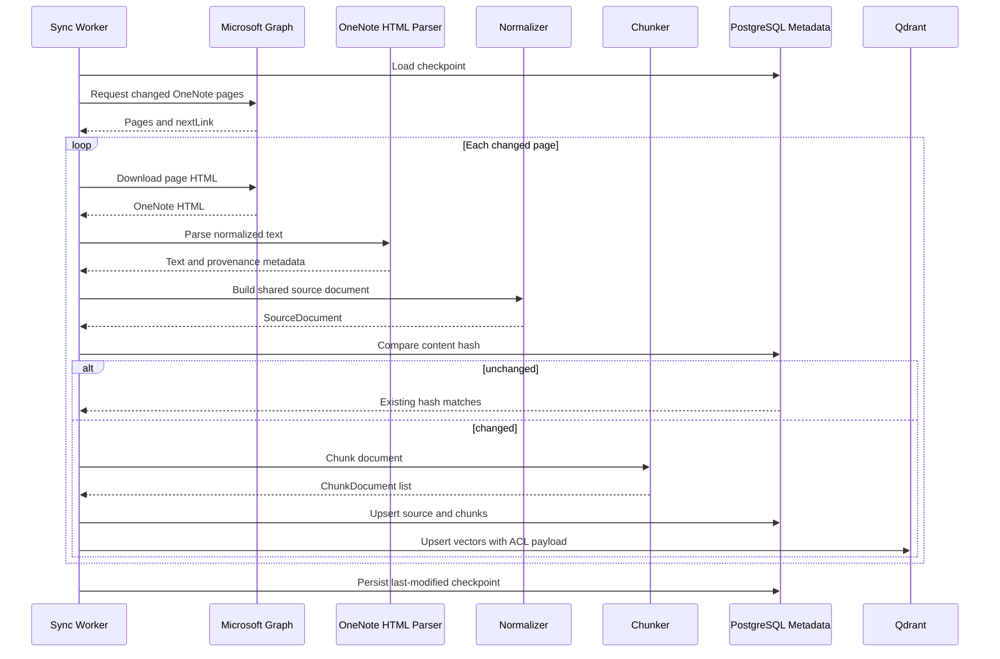

# Ingestion Sequence

```mermaid
sequenceDiagram
    participant Worker as Sync Worker
    participant Graph as Microsoft Graph
    participant Parser as OneNote HTML Parser
    participant Normalizer as Normalizer
    participant Chunker as Chunker
    participant Metadata as PostgreSQL Metadata
    participant Vector as Qdrant

    Worker->>Metadata: Load checkpoint
    Worker->>Graph: Request changed OneNote pages
    Graph-->>Worker: Pages and nextLink
    loop Each changed page
        Worker->>Graph: Download page HTML
        Graph-->>Worker: OneNote HTML
        Worker->>Parser: Parse normalized text
        Parser-->>Worker: Text and provenance metadata
        Worker->>Normalizer: Build shared source document
        Normalizer-->>Worker: SourceDocument
        Worker->>Metadata: Compare content hash
        alt unchanged
            Metadata-->>Worker: Existing hash matches
        else changed
            Worker->>Chunker: Chunk document
            Chunker-->>Worker: ChunkDocument list
            Worker->>Metadata: Upsert source and chunks
            Worker->>Vector: Upsert vectors with ACL payload
        end
    end
    Worker->>Metadata: Persist last-modified checkpoint
```
