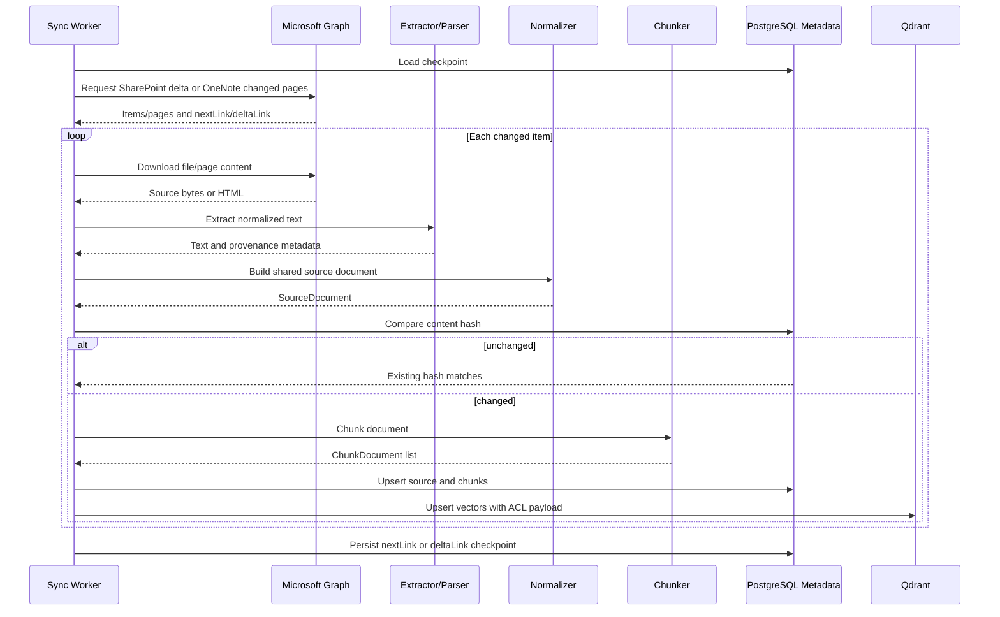

# Ingestion Sequence

```mermaid
sequenceDiagram
    participant Worker as Sync Worker
    participant Graph as Microsoft Graph
    participant Extractor as Extractor/Parser
    participant Normalizer as Normalizer
    participant Chunker as Chunker
    participant Metadata as PostgreSQL Metadata
    participant Vector as Qdrant

    Worker->>Metadata: Load checkpoint
    Worker->>Graph: Request SharePoint delta or OneNote changed pages
    Graph-->>Worker: Items/pages and nextLink/deltaLink
    loop Each changed item
        Worker->>Graph: Download file/page content
        Graph-->>Worker: Source bytes or HTML
        Worker->>Extractor: Extract normalized text
        Extractor-->>Worker: Text and provenance metadata
        Worker->>Normalizer: Build shared source document
        Normalizer-->>Worker: SourceDocument
        Worker->>Metadata: Compare content hash
        alt unchanged
            Metadata-->>Worker: Existing hash matches
        else changed
            Worker->>Chunker: Chunk document
            Chunker-->>Worker: ChunkDocument list
            Worker->>Metadata: Upsert source and chunks
            Worker->>Vector: Upsert vectors with ACL payload
        end
    end
    Worker->>Metadata: Persist nextLink or deltaLink checkpoint
```
