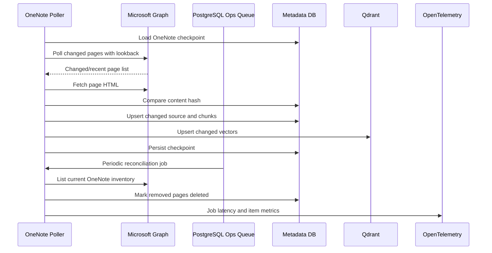

# Operations Sequence

```mermaid
sequenceDiagram
    participant Worker as OneNote Poller
    participant Graph as Microsoft Graph
    participant Queue as PostgreSQL Ops Queue
    participant Metadata as Metadata DB
    participant Vector as Qdrant
    participant OTel as OpenTelemetry

    Worker->>Metadata: Load OneNote checkpoint
    Worker->>Graph: Poll changed pages with lookback
    Graph-->>Worker: Changed/recent page list
    Worker->>Graph: Fetch page HTML
    Worker->>Metadata: Compare content hash
    Worker->>Metadata: Upsert changed source and chunks
    Worker->>Vector: Upsert changed vectors
    Worker->>Metadata: Persist checkpoint
    Queue->>Worker: Periodic reconciliation job
    Worker->>Graph: List current OneNote inventory
    Worker->>Metadata: Mark removed pages deleted
    Worker->>OTel: Job latency and item metrics
```
