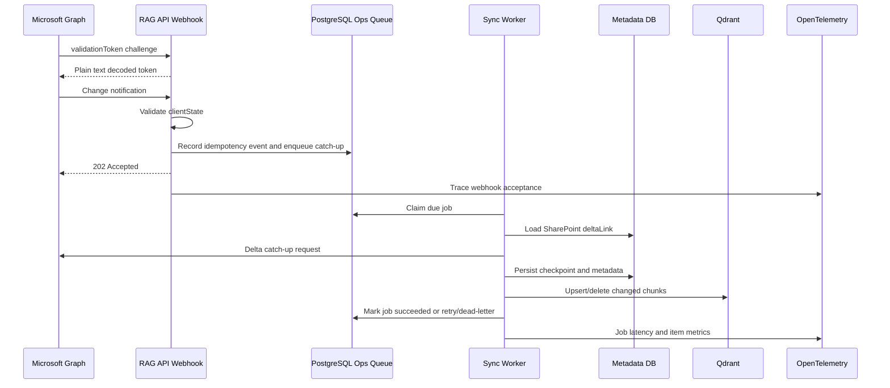

# Operations Sequence

```mermaid
sequenceDiagram
    participant Graph as Microsoft Graph
    participant API as RAG API Webhook
    participant Queue as PostgreSQL Ops Queue
    participant Worker as Sync Worker
    participant Metadata as Metadata DB
    participant Vector as Qdrant
    participant OTel as OpenTelemetry

    Graph->>API: validationToken challenge
    API-->>Graph: Plain text decoded token
    Graph->>API: Change notification
    API->>API: Validate clientState
    API->>Queue: Record idempotency event and enqueue catch-up
    API-->>Graph: 202 Accepted
    API->>OTel: Trace webhook acceptance
    Worker->>Queue: Claim due job
    Worker->>Metadata: Load SharePoint deltaLink
    Worker->>Graph: Delta catch-up request
    Worker->>Metadata: Persist checkpoint and metadata
    Worker->>Vector: Upsert/delete changed chunks
    Worker->>Queue: Mark job succeeded or retry/dead-letter
    Worker->>OTel: Job latency and item metrics
```
