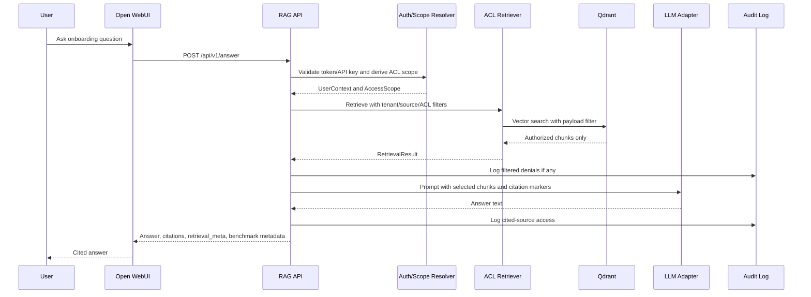

# Query Sequence

```mermaid
sequenceDiagram
    participant User
    participant WebUI as Open WebUI
    participant API as RAG API
    participant Auth as Auth/Scope Resolver
    participant Retriever as ACL Retriever
    participant Vector as Qdrant
    participant LLM as LLM Adapter
    participant Audit as Audit Log

    User->>WebUI: Ask onboarding question
    WebUI->>API: POST /api/v1/answer
    API->>Auth: Validate token/API key and derive ACL scope
    Auth-->>API: UserContext and AccessScope
    API->>Retriever: Retrieve with tenant/source/ACL filters
    Retriever->>Vector: Vector search with payload filter
    Vector-->>Retriever: Authorized chunks only
    Retriever-->>API: RetrievalResult
    API->>Audit: Log filtered denials if any
    API->>LLM: Prompt with selected chunks and citation markers
    LLM-->>API: Answer text
    API->>Audit: Log cited-source access
    API-->>WebUI: Answer, citations, retrieval_meta, benchmark metadata
    WebUI-->>User: Cited answer
```
